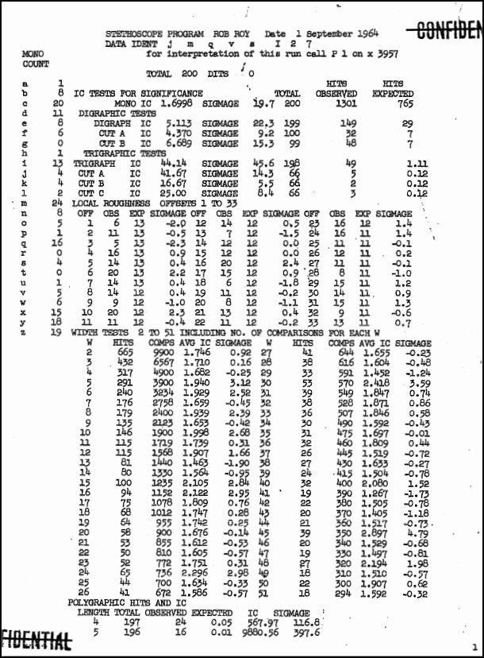

# STETHOSCOPE — Complete Guide

## Overview

STETHOSCOPE is a cryptanalytic diagnostic tool originally developed at the 
NSA that applies a battery of statistical tests — monographic, digraphic, 
trigraphic, and polygraphic index of coincidence, local roughness, width 
tests, and repeat analysis — to an unknown ciphertext to reveal its underlying 
structure. Like a doctor's stethoscope listening for signs of life, it listens 
for statistical patterns that betray the type of cipher used, guiding the 
cryptanalyst toward the most promising line of attack.

---

## Historical Background

STETHOSCOPE was a spectacularly successful software program written for the 
ABNER computer.  Developed in the late 1940s and early 1950s, ABNER was one 
of the NSA’s earliest electronic computers built specifically for cryptanalytic 
work \[1\].

In June 1953, Samuel L. Snyder and Frank Lewis, two top NSA cryptanalysts, 
discussed the idea of a computer program that would perform the tedious initial
tests needed to analyze an unknown cipher system.  Brainstorming with other NSA 
cryptanalysts (Tom Leahy, Bill Lutwiniak, John Riise, Wilur Peterson, and Jerry 
Kimble), a list of cryptanalytic operations was created and implemented, becoming 
the "Stethoscope" program.

First demonstrated on ABNER in October 1953, it became the most successful program
run by cryptanalysts.  Stethoscope very efficiently applied all major statistical 
attacks against cipher text in unknown systems.

The value of Stethoscope can be inferred from the following quote from Brigadier 
John H. Tiltman's 1966 NSA article "Some Reminiscences" \[2\]:

> To return to my quotation. "I have always been rather a lone
> hand, preferring whenever possible to do my own preliminary analysis,
> registration and indexing. I prefer not to embark on machine runs
> any more complicated than the simplest sorting and listing, unless
> there is some very good reasons to believe that they will be profitable."
> By way of comment on that sentence, I ought to have said that a
> special exception should be made in the case of runs of the type of
> the Rob Roy Stethoscope, which, of course, saves a lot of time in
> those cases where repetitious and non-random features within a
> message may provide an immediate clue \[2\].

The first opportunity to see an actual Stethoscope listing occurred when
NSA declassified Lambros D. Callimahos's publication "Cryptanalytic 
Diagnosis with the Aid of a Computer - A Collection of 147 Stethoscope 
Listings" in August 2025 \[3\].  Here is 

---

## How to Use the Tool

### Basic Workflow

1. **Paste the ciphertext** into the Ciphertext box. Spaces, punctuation, and dashes
   (dits, used as null placeholders) are silently ignored; only letters matching the
   selected character set are extracted.

2. **Set the character set** to match the cipher's symbol set:
   - `[A-Za-z]` — standard 26-letter alphabet (the default)
   - `[0-9]` — digit-only ciphertext
   - `[A-Za-z0-9]` — alphanumeric

3. **Add a description** (optional) to label the run in the output report.

4. **Check "Display ciphertext in output"** if you want the cleaned ciphertext
   printed in groups of five at the top of the report — useful for double-checking
   that the right text was submitted.

5. **Set Max repeats** to cap the List of Hits section. 50 is a reasonable default;
   use 0 to show all repeated sequences.

6. **Click Run.** The full battery of tests executes immediately in the browser;
   no data is sent to any server.

7. Optionally **check "Analyze delta stream"** and click Run again to see a second
   full analysis pass on the difference stream (see the Delta Stream section below).

8. **Click Print** to open the browser print dialog and save the report as a PDF.

### Minimum Ciphertext Length

STETHOSCOPE requires at least 4 cipher characters. Meaningful statistics generally
require at least a few hundred characters; the digraphic and trigraphic tests become
reliable above roughly 400–500 characters.

---

## The Tests

### Monographic Frequency Count

The simplest measurement: a count and percentage of each letter's occurrences in
the ciphertext.

**What to look for:**

- In a monoalphabetic substitution cipher, the frequency distribution is skewed —
  a few letters dominate. The distribution mirrors the plaintext language's letter
  frequencies, merely with different labels.
- In a well-mixed polyalphabetic cipher, the distribution flattens toward uniform.
  The flatter the distribution, the higher the period or the more thorough the mixing.
- Severe spikes in a supposedly polyalphabetic cipher can indicate a short period,
  a weak key, or a null-heavy plaintext.

---

### Index of Coincidence (IC) — Monographic

The IC is the probability that two letters drawn randomly from the ciphertext are
the same letter. For a 26-letter alphabet:

- **Random text** (perfectly flat distribution): IC ≈ 0.0385
- **English plaintext** (monoalphabetic substitution): IC ≈ 0.065
- **Polyalphabetic ciphertext**: IC falls between these extremes; the more alphabets
  used (i.e., the longer the period), the closer the IC approaches 0.0385.

The IC is the single most important single-number summary of a ciphertext.
An IC near 0.065 strongly suggests monoalphabetic substitution or a very short period.
An IC below 0.042 suggests a long-period or aperiodic cipher.

The formula for a ciphertext of *N* characters with letter counts *f₁, f₂, …, f_c*
over an alphabet of size *c* is:

    IC = Σ fᵢ(fᵢ − 1) / (N(N − 1))

---

### Local Roughness

Local roughness measures the "lumpiness" of the frequency distribution by summing
the squared deviations of each letter frequency from the expected uniform frequency.

Where the IC gives a single global probability, local roughness captures the same
information in a form that is easier to compare across texts of different lengths.
A high local roughness value indicates an uneven (monoalphabetic-like) distribution;
a low value indicates a flat (polyalphabetic-like) distribution.

---

### Width Tests

Width tests attempt to identify the cipher period by slicing the ciphertext into
columns (as if written into a rectangle of a given width) and measuring the IC of
each column.

If the ciphertext was enciphered with a Vigenère-type cipher of period *d*, then
slicing at width *d* puts letters enciphered by the same alphabet into the same
column. Each column then behaves like monoalphabetic text, and its IC rises toward
the plaintext IC (~0.065 for English). At all other widths, the columns remain
mixed and their ICs stay low.

**Reading the width-test table:**

- Look for a row (period *d*) where *all* column ICs are elevated, not just one or two.
- A period *d* will also cause elevated ICs at widths that are multiples of *d*
  (2*d*, 3*d*, …), though typically weaker. The true period is the smallest *d*
  with consistently high column ICs.
- Very high IC at width 1 (treating the whole text as one column) confirms
  monoalphabetic substitution.

---

### Digraphic Index of Coincidence

The digraphic IC extends the coincidence test to pairs of consecutive letters
(digraphs). Three variants are computed:

- **Overall**: coincidences across all adjacent pairs in the ciphertext.
- **Cut A**: pairs formed by letters at positions (0,1), (2,3), (4,5), … — the
  even-offset digraphs.
- **Cut B**: pairs formed by letters at positions (1,2), (3,4), (5,6), … — the
  odd-offset digraphs.

**What to look for:**

Digraphic ICs amplify the signal from the monographic IC. In a monoalphabetic
cipher the digraphic IC is markedly elevated relative to random; in a well-mixed
polyalphabetic cipher it stays near the random baseline. Comparing Cut A and Cut B
can reveal structural asymmetries — for example, a transposition cipher will often
show different values for the two cuts.

---

### Trigraphic Index of Coincidence

The trigraphic IC extends the analysis to triples of consecutive letters (trigraphs).
Four variants are computed:

- **Overall**: all consecutive triples.
- **Cut A**: triples starting at positions 0, 3, 6, …
- **Cut B**: triples starting at positions 1, 4, 7, …
- **Cut C**: triples starting at positions 2, 5, 8, …

Trigraphic ICs are most useful for distinguishing cipher families. Simple
substitution and short-period polyalphabetic ciphers show elevated trigraphic ICs;
long-period and transposition ciphers do not.

---

### Polygraphic Index of Coincidence

The polygraphic IC computes coincidences for polygraphs of increasing length
(2-grams, 3-grams, 4-grams, …) and reports how the IC falls off as the polygon
length increases.

In a monoalphabetic cipher, the polygraphic IC remains elevated regardless of
polygon length. In a polyalphabetic cipher of period *d*, the polygraphic IC drops
sharply when the polygon length exceeds *d*, because longer polygraphs straddle
multiple alphabets and the repetition structure breaks down.

Tracking the polygraphic IC as a function of length therefore provides another
estimate of the period.

---

### List of Hits (Repeated Sequences)

The List of Hits is a Kasiski-style analysis: it enumerates every repeated sequence
of 3 or more characters, records the positions at which each occurs, and computes
the distances (gaps) between occurrences.

**How to read it:**

- Long repeated sequences are unlikely to be coincidental. A sequence that repeats
  multiple times strongly suggests that the same plaintext letters were enciphered
  by the same alphabet(s).
- The *gaps* between occurrences of the same sequence are key. If many gaps share
  a common factor *d*, that factor is a candidate for the cipher period.
- Short sequences (3–4 letters) repeat by chance more often; favor longer sequences
  when drawing conclusions.
- In a random or very long-period cipher, few or no repetitions appear.

**Setting Max Repeats:** use a small value (10–20) for a quick scan; use 0 to see
everything when you are hunting for a specific sequence.

---

### Delta Stream

The delta stream (also called the difference stream) is a transformed version of
the ciphertext formed by subtracting each letter from the letter *d* positions
ahead, modulo the alphabet size:

    delta[i] = alphabet[ (val(ct[i+d]) − val(ct[i])) mod c ]

where *val(x)* is the numerical value of letter *x* in the chosen alphabet, *c* is
the alphabet size, and *d* is the chosen offset.

**Why compute the delta stream?**

For a running-key or Vigenère-type cipher, the delta stream "differentiates" the
key. If the plaintext has strong regularities (e.g., natural language), those
regularities survive into the delta stream, making period structure visible even
when it is masked in the original ciphertext. The delta stream is particularly
effective at revealing the period of autokey ciphers and long-key Vigenère variants.

When you check **Analyze delta stream**, STETHOSCOPE:

1. Computes the delta stream at the specified offset *d* using the specified
   alphabet.
2. Runs the complete STETHOSCOPE battery again on the delta stream as though it
   were a new ciphertext.

The second-pass report appears below the first in the output, separated by a
double rule, and labelled with the offset and alphabet used.

**Choosing the offset:** start with *d* = 1 (adjacent letters). If you have a
hypothesis about the period, try *d* equal to the suspected period — this can
dramatically enhance the periodicity signal.

**Choosing the alphabet:** the default is the standard ordered alphabet for the
selected character set. Use a keyed alphabet (e.g., `FRIEDMANBCGHJKLOPQSTUVWXYZ`)
when the cipher is known or suspected to use one, since the delta computation
depends on the numerical order of letters, not just their identities.

---

## Tips for Interpretation

### Reading a STETHOSCOPE Report at a Glance

1. **Check the monographic IC first.** IC near 0.065 → monoalphabetic or very
   short period. IC near 0.038 → long period or random. IC between 0.045 and 0.060
   → medium-period polyalphabetic; look at width tests.

2. **Scan the width-test table for a period candidate.** Look for the smallest
   width where all column ICs rise together.

3. **Confirm with the List of Hits.** Do the distances between repeated sequences
   share a common factor that matches your period candidate?

4. **Use digraphic and trigraphic ICs to classify the cipher family.** Elevated
   digraphic IC + low trigraphic IC → transposition is possible. Both elevated →
   monoalphabetic or short polyalphabetic.

5. **Run the delta stream at the candidate period.** A strong IC spike in the
   delta-stream second pass confirms the period hypothesis.

### Common Pitfalls

- **Short ciphertexts** produce unreliable statistics. Under ~100 characters,
  treat all results as suggestive, not conclusive.
- **Nulls and dits** are stripped before analysis. A ciphertext with many nulls
  will have a lower effective letter count; factor this in when the letter count
  seems unexpectedly small.
- **Non-standard alphabets** affect delta-stream results but not the other tests,
  which operate on the alphabet defined by the character set alone.
- **Mixed cipher types** (e.g., a transposition applied after substitution) produce
  anomalous readings. If no single interpretation fits all the test results, consider
  the possibility of a compound cipher.

---

## Quick Reference: Test Baseline Values

All values are approximate and assume a 26-letter alphabet with English plaintext.

| Test | Random text | English plaintext (monoalph.) |
|------|-------------|-------------------------------|
| Monographic IC | 0.0385 | ~0.065 |
| Digraphic IC (overall) | ~0.0015 | elevated |
| Trigraphic IC (overall) | ~0.000059 | elevated |
| Width-test column IC | 0.0385 | ~0.065 (at true period) |

---

## References

\[1\] Samuel S. Snyder, National Security Agency, "ABNER: The ASA Computer, Part II: Fabrication, Operation, and Impact,"
Defense Technical Information Center, 2021.
Available: https://media.defense.gov/2021/Jul/01/2002754529/-1/-1/0/6586518-ABNER-THE-ASA-COMPUTER-PART-II.PDF

\[2\] John H. Tiltman, National Security Agency, "Some Reminiscences", 1966.
Available: https://www.nsa.gov/portals/75/documents/news-features/declassified-documents/tech-journals/some-reminiscences.pdf

\[3\] National Security Agency (NSA) Lambros D. Callimahos: Cryptanalytic Diagnosis with the Aid of a Computer (A
Collection of 147 Stethoscope Listings), 1965.
Available: https://www.governmentattic.org/59docs/NSAlDCCDAC1965.pdf

- Friedman, W. F. *The Index of Coincidence and Its Applications in Cryptanalysis*.
  Riverbank Laboratories, 1922. (Reprinted by Aegean Park Press.)
- Kasiski, F. W. *Die Geheimschriften und die Dechiffrir-Kunst*. Berlin, 1863.
- Sinkov, A. *Elementary Cryptanalysis: A Mathematical Approach*. Mathematical
  Association of America, 1966.
- Beker, H. and Piper, F. *Cipher Systems: The Protection of Communications*.
  Wiley, 1982.
