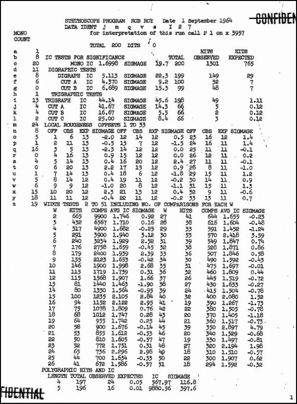
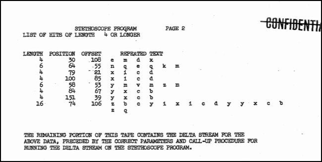

# STETHOSCOPE — Complete Guide

## Overview

STETHOSCOPE is a cryptanalytic diagnostic tool originally developed at the
NSA that applies a battery of statistical tests — monographic, digraphic,
trigraphic, and polygraphic index of coincidence, local roughness, width
tests, and repeat analysis — to an unknown ciphertext to reveal its underlying
structure. Like a doctor's stethoscope listening for signs of life, it listens
for statistical patterns that betray the type of cipher used, guiding the
cryptanalyst toward the most promising line of attack.

---

## Historical Background

STETHOSCOPE was a spectacularly successful software program written for the
ABNER computer.  Developed in the late 1940s and early 1950s, ABNER was one
of the NSA's earliest electronic computers built specifically for cryptanalytic
work \[1\].

In June 1953, Samuel L. Snyder and Frank Lewis, two top NSA cryptanalysts,
discussed the idea of a computer program that would perform the tedious initial
tests needed to analyze an unknown cipher system.  Brainstorming with other NSA
cryptanalysts (Tom Leahy, Bill Lutwiniak, John Riise, Wilur Peterson, and Jerry
Kimble), a list of cryptanalytic operations was created and implemented, becoming
the "Stethoscope" program.

First demonstrated on ABNER in October 1953, it became the most successful program
run by cryptanalysts.  Stethoscope very efficiently applied all major statistical
attacks against cipher text in unknown systems.

The value of Stethoscope can be inferred from the following quote from Brigadier
John H. Tiltman's 1966 NSA article "Some Reminiscences" \[2\]:

> To return to my quotation. "I have always been rather a lone
> hand, preferring whenever possible to do my own preliminary analysis,
> registration and indexing. I prefer not to embark on machine runs
> any more complicated than the simplest sorting and listing, unless
> there is some very good reasons to believe that they will be profitable."
> By way of comment on that sentence, I ought to have said that a
> special exception should be made in the case of runs of the type of
> the Rob Roy Stethoscope, which, of course, saves a lot of time in
> those cases where repetitious and non-random features within a
> message may provide an immediate clue \[2\].

The first opportunity to see an actual Stethoscope listing occurred when
NSA declassified Lambros D. Callimahos's publication "Cryptanalytic
Diagnosis with the Aid of a Computer - A Collection of 147 Stethoscope
Listings" in August 2025 \[3\].  Here is what a typical Stethoscope
listing looked like:

---

## How to Use the Tool

### Basic Workflow

1. **Paste the ciphertext** into the Ciphertext box. Spaces, punctuation, and dashes
   (dits, used as null placeholders) are silently ignored; only letters matching the
   selected character set are extracted.

2. **Set the character set** to match the cipher's symbol set:
   - `[A-Za-z]` — standard 26-letter alphabet (the default)
   - `[0-9]` — digit-only ciphertext
   - `[A-Za-z0-9]` — alphanumeric

3. **Add a description** (optional) to label the run in the output report.

4. **Check "Display ciphertext in output"** if you want the cleaned ciphertext
   printed in groups of five at the top of the report — useful for double-checking
   that the right text was submitted.

5. **Set Max repeats** to cap the List of Hits section. 50 is a reasonable default;
   use 0 to show all repeated sequences.

6. **Click Run.** The full battery of tests executes immediately in the browser;
   no data is sent to any server.

7. Optionally **check "Analyze delta stream"** and click Run again to see a second
   full analysis pass on the difference stream (see the Delta Stream section below).

8. **Click Print** to open the browser print dialog and save the report as a PDF.

### Minimum Ciphertext Length

STETHOSCOPE requires at least 4 cipher characters. Meaningful statistics generally
require at least a few hundred characters; the digraphic and trigraphic tests become
reliable above roughly 400–500 characters.

### A Note on IC Values

STETHOSCOPE reports all IC values in **normalized form**, where a perfectly random
distribution produces IC = **1.0** regardless of alphabet size. This differs from
the classical Friedman IC (where random text over a 26-letter alphabet gives
IC ≈ 0.0385). To convert: multiply the classical IC by the alphabet size *c*.

Under this convention:
- Random text: IC = 1.0
- English monoalphabetic substitution (26 letters): IC ≈ 1.73
- Well-mixed polyalphabetic ciphertext: IC between 1.0 and 1.73, falling toward 1.0
  as the period or number of alphabets increases

---

## Output Sections Reference

Each section below describes what the test measures and what to watch for at a
glance. Follow the link for full mathematical background, baseline tables, and
extended examples drawn from real cipher systems.

### Monographic Frequency Count and IC

The simplest measurement: how often each symbol appears. The monographic IC
summarizes the entire distribution as a single number — the probability that two
randomly drawn ciphertext symbols are identical, normalized so that random text
scores 1.0.

**At a glance:** IC near 1.73 (for a 26-letter alphabet) → monoalphabetic-like
distribution. IC near 1.0 → flat, polyalphabetic-like distribution. Values in
between reflect intermediate mixing. An elevated IC is the first indicator that
the cipher operates with a small effective alphabet or a short period.

→ [In-depth: Monographic IC](output/mono-ic.md)

---

### Digraphic Tests — Digraph IC, CUT A, CUT B

The digraphic IC measures coincidences between pairs of adjacent ciphertext
symbols. Two non-overlapping cuts are also computed:

- **CUT A**: digraphs at positions (1,2), (3,4), (5,6), … — pairs aligned to the
  even boundary.
- **CUT B**: digraphs at positions (2,3), (4,5), (6,7), … — pairs crossing the
  even boundary.

**At a glance:** elevation of *both* CUT A and CUT B above the random baseline
signals a period-2 digraphic cipher. The *relative* elevation of CUT A versus
CUT B is the key diagnostic:

- CUT A substantially higher than CUT B → the in-phase pairs are more constrained
  than the cross-boundary pairs; characteristic of Playfair and similar ciphers
  where each encipherment unit is a matched digraph.
- CUT A ≈ CUT B → both cuts are equally constrained; characteristic of
  biliteral-type ciphers where the two coordinate streams are drawn from disjoint
  alphabets of equal size.

→ [In-depth: Digraphic Tests](output/digraphic-tests.md)

---

### Trigraphic Tests — Trigraph IC, CUT A, CUT B, CUT C

The trigraphic IC extends the coincidence test to non-overlapping triples. Three
cuts are computed, starting at positions 1, 2, and 3 respectively.

**At a glance:** strong elevation of all three cuts, with CUT A highest, signals
a period-3 trigraphic cipher. The ordering CUT A > CUT B > CUT C reveals that
the first coordinate position of each encipherment unit is the most constrained —
typical of systems where the first output digit or letter is drawn from a smaller
or more skewed distribution than the second and third.

→ [In-depth: Trigraphic Tests](output/trigraphic-tests.md)

---

### Local Roughness

Local roughness measures the autocorrelation of the ciphertext at lags 1 through
33: for each lag *k*, it counts the number of positions where `ct[i] == ct[i+k]`
and compares this to the expected count under the null hypothesis of randomness.

**At a glance:** three patterns are diagnostically important:

- **Hard zeros** (observed count = 0) at specific lags → the ciphertext uses
  *disjoint* alphabets. In a period-2 system with fully disjoint row and column
  alphabets (e.g., biliteral substitution with variants), all *odd* lags produce
  hard zeros because cross-type comparisons are structurally impossible.
- **Flat profile near expected** → overlapping alphabets. Playfair and four-square
  produce flat local roughness because both symbols of each ciphertext digraph
  are drawn from the full 25-letter alphabet.
- **Alternating pattern** of peaks at multiples of the period and depressions
  elsewhere → a periodic disjoint system. The pattern distinguishes period-2
  disjoint systems (every even lag elevated) from period-3 disjoint systems
  (every multiple-of-3 lag elevated).

→ [In-depth: Local Roughness](output/local-roughness.md)

---

### Width Tests

Width tests lay the ciphertext into a rectangle of width *W* (for *W* = 2 to 51)
and compute the average IC across all columns. At the true period, letters
enciphered by the same sub-alphabet fall into the same column, raising the
average column IC.

**At a glance:** look for the pattern of elevated widths:

- Elevation at *W* = *d*, 2*d*, 3*d*, … with depression at non-multiples →
  dominant period *d*. The fundamental period shows the strongest signal;
  multiples show weaker secondary peaks.
- A clean even/odd alternation (even widths elevated, odd widths depressed, or
  vice versa) → period-2 disjoint system.
- Elevation exclusively at multiples of 3 → period-3 system.
- Width tests are generally more decisive than local roughness on short messages
  because they aggregate across all column pairs rather than counting single-lag
  coincidences.

→ [In-depth: Width Tests](output/width-tests.md)

---

### Polygraphic Hits and IC

For polygon lengths 3, 4, 5, … the tool counts how many non-overlapping polygrams
of that length appear more than once, and compares this to the number expected by
chance. The result is expressed as an IC and a sigmage (standard deviations above
the mean).

**At a glance:**

- **Modest elevation** (sigmage 2–5) → structural non-randomness; consistent with
  any non-random cipher system over a short message.
- **Catastrophic elevation** (sigmage in the tens or hundreds) → the same
  plaintext polygram has been enciphered repeatedly to the same ciphertext output.
  This is the hallmark of a *deterministic* cipher (one where the same plaintext
  always produces the same ciphertext): Playfair, four-square, and the decimal
  matrix system all belong to this family.
- When polygraphic evidence is catastrophic, it is the dominant diagnostic signal
  and overrides weaker signals from isomorphs or local roughness.

→ [In-depth: Polygraphic Hits](output/polygraphic-hits.md)

---

### List of Hits

The List of Hits enumerates every repeated sequence of length ≥ 4, recording
position, offset between occurrences, and the repeated text itself.

**At a glance:**

- **Offset divisible by the period** and starting **in-phase** → genuine
  plaintext repetition enciphered identically. These are the most useful entries.
- **Long repeated sequences** (length ≥ 6 for a period-2 cipher, ≥ 9 for
  period-3) represent at least two full encipherment units repeated, giving
  direct leverage on reconstruction.
- **Offset and phase checks are mandatory** before drawing conclusions: an
  out-of-phase repeat, or a repeat whose offset is not a multiple of the period,
  cannot represent a repeated plaintext unit in the same alignment.

→ [In-depth: List of Hits](output/list-of-hits.md)

---

### Significant Isomorphs

An isomorph is a pair of ciphertext substrings that exhibit the same letter-
substitution pattern: wherever the first substring has letter *X* at some
position, the second substring has a fixed letter *Y* at the same relative
position, consistently throughout. Isomorphs are reported when their expected
frequency under randomness falls below 0.5.

**At a glance:**

- **For monoalphabetic ciphers**: isomorphs are powerful — a consistent pattern
  must reflect the same sequence of plaintext letters enciphered by the same key.
- **For period-2 digraphic ciphers**: isomorphs are useful only when the two
  strings are *in-phase* (both starting at the first symbol of an encipherment
  unit) and the offset between them is a multiple of the period. Out-of-phase
  isomorphs are structurally impossible as plaintext repetitions and are
  definitively spurious.
- **For deterministic digraphic or trigraphic ciphers with catastrophic
  polygraphic hits**: ignore the isomorph list entirely. The direct evidence
  from the List of Hits is far more productive, and coincidental isomorphs are
  common in short, structured ciphertexts.

→ [In-depth: Isomorphs](output/isomorphs.md)

---

### Delta Stream

The delta stream transforms the ciphertext by subtracting each symbol from the
symbol *d* positions ahead, modulo the alphabet size:

    delta[i] = alphabet[ (val(ct[i+d]) − val(ct[i])) mod c ]

STETHOSCOPE then runs the complete battery a second time on this transformed
sequence. For running-key and autokey Vigenère variants, the delta stream
"differentiates" the key, making periodic structure visible even when it is
suppressed in the original ciphertext.

**At a glance:** start with offset *d* = 1. If you have a period hypothesis,
try *d* equal to the suspected period — this can dramatically sharpen the
periodicity signal in the second-pass report.

---

## Diagnostic Methodology

Reading a STETHOSCOPE listing is not a matter of checking one number; it is a
sequence of narrowing questions. This section gives the recommended order of
attack and explains which combinations of results point to which cipher families.

### The Sequence of Questions

**Step 1 — What is the ciphertext alphabet?**

Before touching any statistic, note whether the ciphertext consists of letters,
digits, or a mix. An all-digit ciphertext immediately rules out every letter-
output cipher family (Playfair, four-square, Vigenère, etc.) and points toward
a coordinate-based or matrix system.

**Step 2 — Is the distribution flat or rough? (Mono IC)**

- IC near 1.0 → the symbols are well-mixed; look for a long period or a
  polyalphabetic system.
- IC substantially above 1.0 → non-uniform distribution; short period,
  monoalphabetic substitution, or a coordinate-based system whose output
  alphabet is not fully exploited.

**Step 3 — What is the dominant period? (Width Tests, then Local Roughness)**

Width tests give the cleaner answer on short messages. Look for the smallest
width *d* where the average column IC is consistently elevated, and where
multiples of *d* also show secondary peaks. Local roughness confirms the period
and adds information about alphabet structure (disjoint vs. overlapping).

**Step 4 — Are the alphabets disjoint or overlapping? (Local Roughness)**

- Hard zeros at specific lags → disjoint alphabets; in a period-2 system,
  hard zeros at all odd lags are diagnostic of biliteral-type ciphers.
- Flat profile near expected → overlapping alphabets; Playfair and four-square
  fall here.
- Depressed but non-zero at cross-period lags → constrained but overlapping;
  the decimal matrix system (§69e) falls here.

**Step 5 — Is the cipher deterministic? (Polygraphic Hits)**

Catastrophic polygraphic sigmage (tens or hundreds of standard deviations above
expected) means the same plaintext maps to the same ciphertext every time. This
is present in Playfair, four-square, and decimal matrix systems. When this
signal is present, it dominates: move directly to the List of Hits for
reconstruction leverage.

**Step 6 — What does CUT A vs. CUT B tell us? (Digraphic / Trigraphic Tests)**

For a confirmed period-2 system:
- CUT A >> CUT B → Playfair family (in-phase digraph pairs more constrained).
- CUT A ≈ CUT B, local roughness shows hard zeros at odd lags → biliteral family.
- CUT A > CUT B but CUT B substantially elevated → four-square family.

For a confirmed period-3 system:
- Trigraphic CUT A >> CUT B > CUT C → the three coordinate positions have
  decreasing entropy; characteristic of a decimal matrix or trifid-family system.

**Step 7 — Are the isomorphs genuine or coincidental?**

Apply the phase test: is the isomorph in-phase (both strings starting at the
first symbol of an encipherment unit)? Is the offset a multiple of the period?
If either test fails, the isomorph is structurally spurious. If polygraphic
evidence is catastrophic, skip the isomorph analysis entirely.

---

### Period Detection: Width Tests vs. Local Roughness

Both tests address the same underlying question — what is the period? — but
from different angles and with different statistical power.

**Width tests** aggregate evidence across all column pairs at a given width,
making them more reliable for short messages. The pattern of elevated vs.
depressed widths is usually unambiguous even at 300 characters.

**Local roughness** operates at the individual-lag level and is therefore
noisier. Its unique contribution is *qualitative*: hard zeros cannot be produced
by an overlapping-alphabet cipher regardless of message length, so a single
hard zero at an odd lag is definitive proof of a disjoint alphabet even when
the width-test signal is ambiguous.

Use both together: width tests to establish the period, local roughness to
characterize the alphabet structure.

---

### When to Trust Isomorphs — and When to Ignore Them

An isomorph is meaningful only under specific conditions:

1. The cipher is *not* deterministic at the polygraphic level (i.e., polygraphic
   sigmage is not catastrophic). When exact repetitions dominate, coincidental
   isomorphs proliferate and provide no independent evidence.

2. The two strings are *in-phase*: both start at the first symbol of an
   encipherment unit. An odd-offset isomorph in a period-2 cipher is
   definitionally impossible as a plaintext repetition, because the two strings
   would compare a first-coordinate symbol against a second-coordinate symbol
   drawn from a different (possibly disjoint) alphabet.

3. The offset between the two strings is a multiple of the period.

When all three conditions hold, a significant isomorph (expected < 0.5) is
worth pursuing. When any condition fails, file it as a coincidence and move on.

---

## Cipher Fingerprint Reference

The table below summarizes the STETHOSCOPE signature of each cipher family
covered by the worked analyses. Values are approximate and assume messages of
300 characters or more.

| System | Period | Alphabet | Mono IC | CUT A vs. CUT B (digraphic) | Local Roughness | Polygraphic | Isomorphs |
|--------|--------|----------|---------|-----------------------------|-----------------|-------------|-----------|
| Monoalphabetic substitution | 1 | 26 letters, overlapping | ~1.73 | — | Flat, elevated overall | Very high | Reliable |
| Playfair | 2 | 26 letters, overlapping | ~1.4 | CUT A >> CUT B | Flat (no hard zeros) | High–catastrophic | Phase-dependent |
| Four-square | 2 | 26 letters, overlapping | ~1.4 | CUT A > CUT B (CUT B more elevated than Playfair) | Flat (no hard zeros) | Catastrophic | Ignore |
| Biliteral with variants | 2 | 26 letters, **disjoint** | ~1.4 | CUT A ≈ CUT B | **Hard zeros at all odd lags** | Low | In-phase only |
| Decimal matrix (§69e) | 3 | 10 digits, constrained | ~1.17 | CUT B ≥ CUT A | Depressed at non-multiples of 3 (no hard zeros) | Catastrophic | Ignore |

Detailed evidence for each row is in the corresponding worked analysis.

---

## Worked Analyses

Each analysis presents the raw STETHOSCOPE listing followed by a section-by-
section commentary, diagnostic reasoning, and — where the solution is known —
confirmation against the actual plaintext and key.

- [Playfair — MC-I §71e](analyses/playfair-mci-71e.md)
- [Biliteral substitution — MC-I §60](analyses/biliteral-mci-60.md)
- [Four-square matrix — MC-I §69c](analyses/four-square-mci-69c.md)
- [Decimal matrix — MC-I §69e](analyses/decimal-matrix-mci-69e.md)

---

## Glossary

**CUT A / CUT B / CUT C**
Non-overlapping sub-sequences of a ciphertext formed by taking every *n*th
symbol starting at positions 1, 2, and 3 respectively (for trigraphic cuts).
Used to isolate individual coordinate streams in multi-coordinate cipher systems.

**Deterministic cipher**
A cipher in which the same plaintext always produces the same ciphertext (given
the same key and position). Playfair, four-square, and matrix substitution
ciphers are deterministic; running-key and autokey Vigenère variants are not.

**Disjoint alphabets**
Two ciphertext streams are said to use disjoint alphabets when the set of symbols
that can appear in one stream has no overlap with the set in the other. In a
biliteral cipher, the row-coordinate and column-coordinate streams use entirely
separate letters. Disjoint alphabets produce hard zeros in the local roughness
at cross-stream lags.

**IC (Index of Coincidence)**
The probability that two randomly chosen ciphertext symbols are identical,
normalized (in STETHOSCOPE) so that a perfectly flat distribution scores 1.0.
Higher values indicate a more uneven (monoalphabetic-like) distribution.

**Isomorph**
A pair of ciphertext substrings that share the same letter-substitution pattern:
wherever one string has symbol *X*, the other has a fixed symbol *Y* at the
same relative position. Significant when the expected frequency under randomness
falls below 0.5.

**Local Roughness**
The autocorrelation of the ciphertext at lags 1 through 33: for each lag *k*,
the count of positions where `ct[i] == ct[i+k]`, compared to the expectation
under randomness.

**Overlapping alphabets**
Two ciphertext streams share the same pool of possible symbols (e.g., both draw
from the full 25-letter Playfair alphabet). Produces a flat local roughness
profile with no hard zeros.

**Period**
The length of the repeating encipherment unit. A period-2 cipher enciphers two
plaintext symbols at a time; a period-3 cipher enciphers three at a time.

**Phase**
The alignment of a substring with respect to the encipherment unit boundaries.
An in-phase substring starts at the first symbol of a unit (position 1, 3, 5, …
for a period-2 cipher). An out-of-phase substring starts mid-unit.

**Polygraphic IC**
The IC computed over polygrams (groups of *n* consecutive symbols) for
increasing values of *n*, measuring how rapidly coincidences fall off with
polygon length.

**Sigmage**
The number of standard deviations by which an observed statistic departs from
its expected value under the null hypothesis of random text. A sigmage of 3 or
above is conventionally considered significant.

**Trigraphic / Digraphic**
Referring to cipher systems whose fundamental encipherment unit is, respectively,
three symbols (trigraphic) or two symbols (digraphic).

---

## Appendix A: Statistical Baselines

Expected IC values under STETHOSCOPE's normalized convention (random = 1.0):

| Alphabet size | Random IC | English monoalphabetic IC |
|---------------|-----------|---------------------------|
| 10 (digits)   | 1.0       | N/A (plaintext is language-dependent) |
| 26 (letters)  | 1.0       | ~1.73 |
| 36 (alphanumeric) | 1.0   | ~1.4 (estimate) |

For digraphic tests, the random baseline for CUT A and CUT B is 1.0; values
above ~1.3 at message lengths of 300 are conventionally significant (sigmage ≥ 3).

For local roughness, the expected count at each lag *k* is approximately
*N* / *c*, where *N* is the message length and *c* is the alphabet size.
A sigmage of ±2.5 or beyond at a specific lag is worth noting; a hard zero
(observed = 0) at any lag is structurally significant regardless of sigmage.

---

## Appendix B: STETHOSCOPE Version History

| Version | Date | Notes |
|---------|------|-------|
| 0.20 | July 2026 | First public release with full digraphic/trigraphic/polygraphic suite |
| 0.21 | July 2026 | Extended alphabet support; lowercase mono count display |

---

## References

\[1\] Samuel S. Snyder, National Security Agency, "ABNER: The ASA Computer, Part II: Fabrication, Operation, and Impact,"
Defense Technical Information Center, 2021.
Available: <https://media.defense.gov/2021/Jul/01/2002754529/-1/-1/0/6586518-ABNER-THE-ASA-COMPUTER-PART-II.PDF>

\[2\] John H. Tiltman, National Security Agency, "Some Reminiscences", 1966.
Available: <https://www.nsa.gov/portals/75/documents/news-features/declassified-documents/tech-journals/some-reminiscences.pdf>

\[3\] National Security Agency (NSA) Lambros D. Callimahos: Cryptanalytic Diagnosis with the Aid of a Computer (A
Collection of 147 Stethoscope Listings), 1965.
Available: <https://www.governmentattic.org/59docs/NSAlDCCDAC1965.pdf>

- Friedman, W. F. *The Index of Coincidence and Its Applications in Cryptanalysis*.
  Riverbank Laboratories, 1922. (Reprinted by Aegean Park Press.)
- Kasiski, F. W. *Die Geheimschriften und die Dechiffrir-Kunst*. Berlin, 1863.
- Sinkov, A. *Elementary Cryptanalysis: A Mathematical Approach*. Mathematical
  Association of America, 1966.
- Beker, H. and Piper, F. *Cipher Systems: The Protection of Communications*.
  Wiley, 1982.
